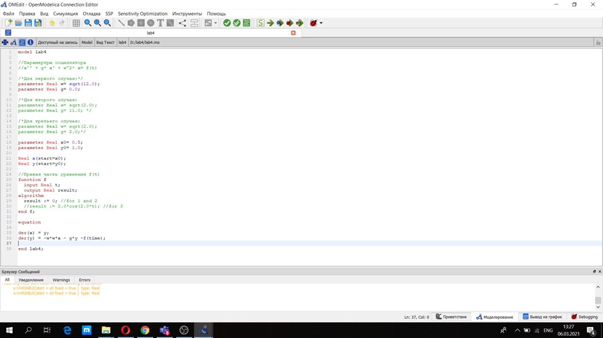
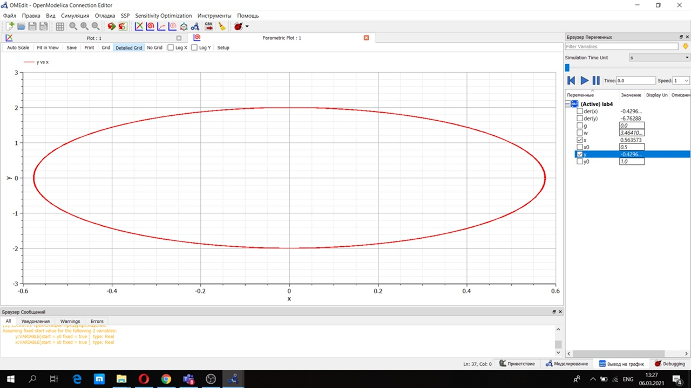
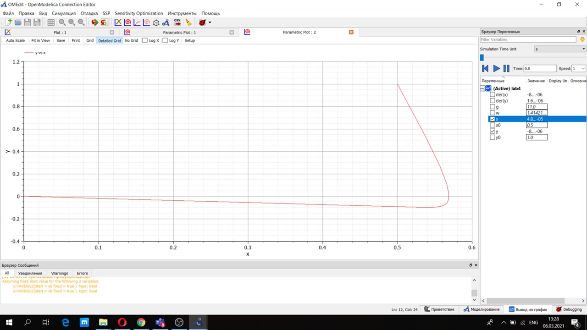
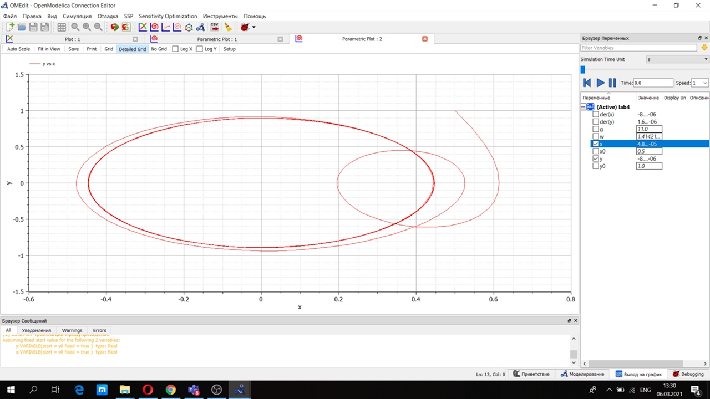

---
# Front matter
lang: ru-RU
title: "Лабораторная работа №4"
author: "Селезнев Василий Александрович"

# Formatting
toc-title: "Содержание"
toc: true # Table of contents
toc_depth: 2
lof: true # List of figures
lot: true # List of tables
fontsize: 12pt
linestretch: 1.5
papersize: a4paper
documentclass: scrreprt
polyglossia-lang: russian
polyglossia-otherlangs: english
mainfont: PT Serif
romanfont: PT Serif
sansfont: PT Sans
monofont: PT Mono
mainfontoptions: Ligatures=TeX
romanfontoptions: Ligatures=TeX
sansfontoptions: Ligatures=TeX,Scale=MatchLowercase
monofontoptions: Scale=MatchLowercase
indent: true
pdf-engine: lualatex
header-includes:
  - \linepenalty=10 # the penalty added to the badness of each line within a paragraph (no associated penalty node) Increasing the value makes tex try to have fewer lines in the paragraph.
  - \interlinepenalty=0 # value of the penalty (node) added after each line of a paragraph.
  - \hyphenpenalty=50 # the penalty for line breaking at an automatically inserted hyphen
  - \exhyphenpenalty=50 # the penalty for line breaking at an explicit hyphen
  - \binoppenalty=700 # the penalty for breaking a line at a binary operator
  - \relpenalty=500 # the penalty for breaking a line at a relation
  - \clubpenalty=150 # extra penalty for breaking after first line of a paragraph
  - \widowpenalty=150 # extra penalty for breaking before last line of a paragraph
  - \displaywidowpenalty=50 # extra penalty for breaking before last line before a display math
  - \brokenpenalty=100 # extra penalty for page breaking after a hyphenated line
  - \predisplaypenalty=10000 # penalty for breaking before a display
  - \postdisplaypenalty=0 # penalty for breaking after a display
  - \floatingpenalty = 20000 # penalty for splitting an insertion (can only be split footnote in standard LaTeX)
  - \raggedbottom # or \flushbottom
  - \usepackage{float} # keep figures where there are in the text
  - \floatplacement{figure}{H} # keep figures where there are in the text
---

# Цель работы

Познакомиться с моделью гармонических колебаний осциллятора, используя язык программирования Modelica.

# Задание

1. Построить решение уравнения гармонического осциллятора без затухания(2)
2. Записать уравнение свободных колебаний гармонического осциллятора с затуханием, построить его решение. Построить фазовый портрет гармонических колебаний с затуханием.
3. Записать уравнение колебаний гармонического осциллятора, если на систему действует внешняя сила, построить его решение. Построить фазовый портрет колебаний с действием внешней силы.

# Выполнение лабораторной работы

Рассмотрим модель осциллятора  
1. Первый случай (без затухания и без действия внешней силы)  

$$ \ddot {x} + 12x = f(t) $$
где  
$w = \sqrt{12.0}$  
$\gamma = 0.0$  
$f(t) = 0.0$  

2. Второй случай (с затуханием и без действия внешней силы)  

$$ \ddot {x} + 11 \dot {x} + 2x = 0 $$
где  
$w = \sqrt{2.0}$  
$\gamma = 11.0$  
$f(t) = 0.0$  

3. Третий случай(с затуханием и под действием внешней силы)

$$ \ddot {x} + 2 \dot {x} + 2x = 2cos(2t) $$
где  
$w = \sqrt{2.0}$  
$\gamma = 2.0$  
$f(t) = 2.0cos(2t)$  

Ниже представлен скриншот кода программы для трех случаев, написанный на языке программирования Modelica. (рис 1. -@fig:001)  

{ #fig:001 width=70% }  

Представлен график для первого случая. (рис 2. -@fig:001)  

{ #fig:001 width=70% }  

Ниже представлен график для второго случая. (рис 3. -@fig:001)  

{ #fig:001 width=70% }    

Также представлен график для третьего случая. (рис 4. -@fig:001)  

{ #fig:001 width=70% }   

# Выводы

Я научился строить модель гармонического осцилятора на языке программирования Modelica.
